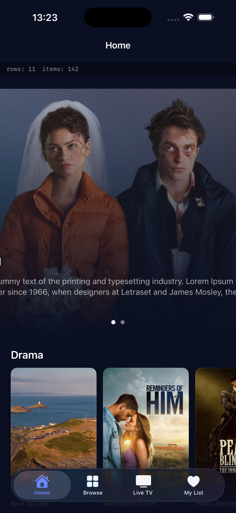

# OTNet iOS

A Netflix-style iOS streaming app starter built with SwiftUI and async/await,
powered by the [OTNet](https://otnet.io) catalog, EPG and playback APIs. Drop
in your publisher API key and the app boots straight into your catalogue —
homepage rows, browse, content detail, live TV guide.



## Features

- **TabView shell** — Home, Browse, Live TV, My List (Live TV and My List are
  conditional on publisher settings)
- **Home** — auto-rotating landscape hero (8s) + horizontally-scrolling rows
  grouped by genre, driven by `/catalog/homepage`
- **Browse** — categories tree → adaptive grid of poster cards
- **Content detail** — backdrop, metadata pills, age rating badge, Play CTA,
  season tabs + episode list for series
- **Live TV** — channel list with current program, driven by `/catalog/epg`
- **Player** — `AVPlayer` + `AVContentKeySession` for FairPlay HLS, with a
  plain `AVPlayer(url:)` fast-path for clear variants
- **Observability** — `DebugProbe` logs `status / type / bytes / URL` for
  every API request; `DebugBar` shows row + item counts above Home in `#if
  DEBUG` builds
- **Defensive decoding** — every Codable field is optional with a `displayX`
  accessor; no field-level decoding error blanks the screen
- **Explicit states** — every list screen renders one of loading / empty /
  error / data via a shared `StatePlaceholder`

## Tech stack

- Swift 5.9, SwiftUI, async/await
- iOS 16+
- Only Apple frameworks (Foundation, SwiftUI, AVKit, AVFoundation)
- [XcodeGen](https://github.com/yonaskolb/XcodeGen) for project generation

No third-party dependencies.

## Quick start

```bash
git clone git@github.com:OTNetMedia/otnet-ott-streaming-ios-mobile.git
cd otnet-ott-streaming-ios-mobile

# 1. Add your API key
cp OTNetApp/Networking/Secrets.swift.example OTNetApp/Networking/Secrets.swift
# edit Secrets.swift and paste your OTNet publisher API key

# 2. Generate the Xcode project
brew install xcodegen   # if you don't have it
xcodegen

# 3. Open and run
open OTNetApp.xcodeproj
```

Pick an iPhone simulator and hit ⌘R.

## Configuration

### 1. API key

`OTNetApp/Networking/Secrets.swift` is **git-ignored**. The committed template
is `Secrets.swift.example`. Get a publisher key at [otnet.io](https://otnet.io)
and drop it in:

```swift
enum Secrets {
    static let otNetApiKey = "otn_…"
}
```

The networking actor crashes early on launch if the key is missing or still
the placeholder — that's deliberate. Better to fail loud than to debug a
blank home screen.

### 2. Publisher feature flags

Tab visibility is currently hardcoded in `OTNetApp.swift`:

```swift
RootView(
    epgEnabled: true,        // shows the Live TV tab
    myListEnabled: true,     // shows the My List tab
    viewerAuthNone: false    // hides My List when no viewer auth is configured
)
```

On the next iteration these will be driven by a fetch to `/catalog/settings`.
For now, change them to match your publisher configuration.

## Project layout

```
OTNetApp/
  App/                    @main + TabView shell
  Networking/             URLSession actor, X-Api-Key header, DebugProbe
  Models/                 Codable models (every field optional)
  Features/
    Home/                 Hero + rows
    Browse/               Categories tree → grid
    ContentDetail/        Detail + season tabs + episodes
    Player/               AVPlayer + FairPlay key delegate
    LiveTV/               EPG channel list
    MyList/               Watchlist (needs viewer auth, currently 401s)
  Components/             PosterCard, LandscapeCard, ContentRow, HeroBanner,
                          StatePlaceholder, DebugBar, AgeRatingBadge, MetaPill
  Theme/                  OTNetTheme colours, radii, spacing
  Resources/              Assets.xcassets, Info.plist
docs/                     README screenshots
project.yml               XcodeGen spec
```

## Observability

Every API response is logged to the console:

```
[OTNetAPI] 200 HomepageResponse 281937b. https://otnet.io/api/v1/catalog/homepage
```

When the home screen is empty, the `DebugBar` shows `rows: N items: N` plus
the last error. If the bar reads `rows: 0 items: 0 http(401)` you know to
check your API key, not your UI code.

## What's not built yet

The skeleton is intentionally narrow. These are the obvious next prompts:

- Keychain-backed viewer sign-in (`/viewer/auth/{register,login,refresh}`)
- Watch progress sync (`/viewer/progress` or `/device/progress`)
- Search
- Profile picker (when viewer auth is enabled)
- Wiring tab visibility to `/catalog/settings` instead of hardcoded flags

## License

MIT.
